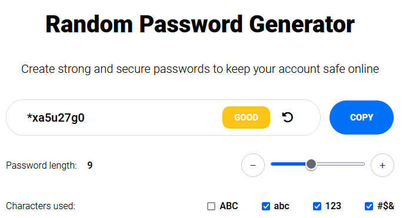

# Random Password Generator!

This is a random password generator app created and designed by me.

# 📝 Table of contents

-   [Overview](#overview)
-   [Live demo](#live-demo)
-   [Screenshot](#screenshot)
-   [Tech stack](#tech-stack)
-   [Author](#author)

# ✏️ Overview

Users should be able to:

-   change size of website and look how layout change,
-   select which type of signs are able to be in pasword,
-   copy generated password to clipboard

# 🟢 Live demo [Random Password Generator](https://thriving-squirrel-018761.netlify.app/)

# 📷 Screenshot

## Built with

# 🔗 Author

